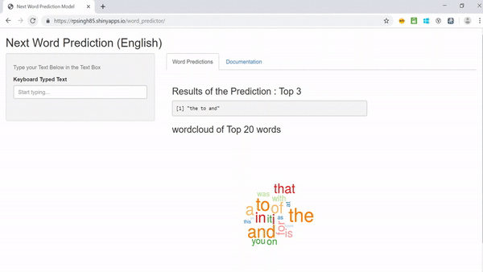

```{r setup, include=FALSE}
knitr::opts_chunk$set(echo = FALSE)
```

## Introduction

This Presentation is created to pitch an Application build to predict the **Next Word** while typing through Keyboard. This application built as part of the final Capstone Project for Coursera Data Science certification offered in collaboration with John Hopkins University.

### **Goal of Project:**

Goal of project is to build Predictive Model for English Language text. Skills Required for building Predictive Model:

- Natural Language Processing.
- Text Mining.
- Data Exploration, Loading and Cleaning of Data.
- Shiny App Building Skills.

## Input Dataset Details

Source Data for Project is found @ <https://d396qusza40orc.cloudfront.net/dsscapstone/dataset/Coursera-SwiftKey.zip>

- Dataset contains the Text files recorded From US News, Blogs websites and Tweets from Twitter.
- It has Text files from English, German and French Language.
- <span style="color:blue">*We have built a Model only for English Language* </span>

This Data set is provided by the SwiftKey Company for developing the text prediction model.

## Text Prediction Model Approach

Following steps are performed to Build an Text Prediction App:

- **Text Mining** : All Files are read and taken a subtastantial subset of those files. Clubbed together for Text Analysis.
- Removed Profanities i.e. Bad Words.
- Remove Whitespaces, punctuation and numbers to Clean it up.
- **Tokenization** : Tokenizing the data by creating 1-Gram, 2-Gram, 3-Gram, 4-Gram Datasets capturing the frequency of word combination occurrances.
- Use N-Gram | N-1 Gram, **Back-Off** Model technique along with N-Gram Models to Predict the Next Word.

## Next Word Prediction Application

<span style="color:blue">**Below is the Working Model of Next Word Predictor App** </span>




## Repository Paths

### Code Repository @ GitHub : <font size="4"><https://github.com/ravinderpratap/Capstone_coursera></font>
  - Capstone_Exploratory_NGram.R : Text Mining, Cleaning and Tokenization
  - Next_Word_Predictor.R : Function for Prediction used in Shiny App by loading dataset created.
  - word_predictor : Folder contains ui.R and server.R code for App.

### Shiny App Link : <font size="5"><https://rpsingh85.shinyapps.io/word_predictor/></font>

### Presentation Link : <font size="5"><http://rpubs.com/ravinderpratap/Word_Prediction_Presentation></font>